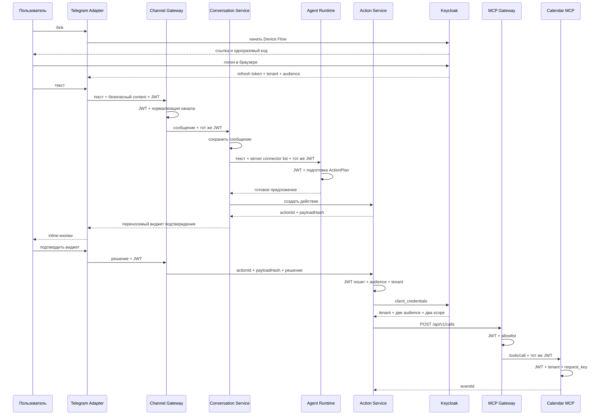

# Архитектура

```text
репа сервиса -> общий CI -> container + SBOM + signature
                              |
services/catalog.json -> environments/<env>/services/<name>/values.yaml
                              |
                      Argo CD ApplicationSet
                              |
                       charts/service -> Kubernetes
                              |
                  OpenTelemetry -> metrics/logs/traces
```

`services/catalog.json` — реестр сервисов, `environments` — различия окружений, а
`charts/service` — единые правила запуска. В values нет секретов: указываются только ссылки на
ключи Kubernetes Secret. Production намеренно не создан до отдельного ADR и выбора облака.

Локальная среда работает через Compose и использует те же классы зависимостей, что будущий
кластер. Полный smoke создаёт только временный k3d-кластер и всегда удаляет лишь созданный им
кластер.

Для pull request используется отдельный namespace `portable-agent-pr-<number>`. Chart `preview`
создаёт Namespace, ResourceQuota, LimitRange и default-deny NetworkPolicy, после чего приложения
устанавливаются существующим `service` chart. Сейчас CI проверяет эту модель в одноразовом k3d;
постоянный кластер позже добавит ingress, DNS и автоматическое удаление по метке срока жизни.

## Локальный execution slice



Canonical issuer локального realm доступен хосту через `localhost`. Контейнеры загружают JWKS по
внутреннему имени `keycloak`, поэтому проверка токена не зависит от DNS хоста. `start-local -Apps`
сначала поднимает зависимости и создаёт Temporal namespace, затем собирает и запускает приложения.
Channel Gateway не зависит от Telegram и принимает общий контракт сообщения `2.4.0`. Conversation
Service хранит состояние диалога, получает предложение от Agent Runtime, создаёт Action и возвращает
каналу переносимый виджет. Agent Runtime не исполняет и не сохраняет действие. После подтверждения
Action Service остаётся источником состояния, аудита и Temporal workflow.
