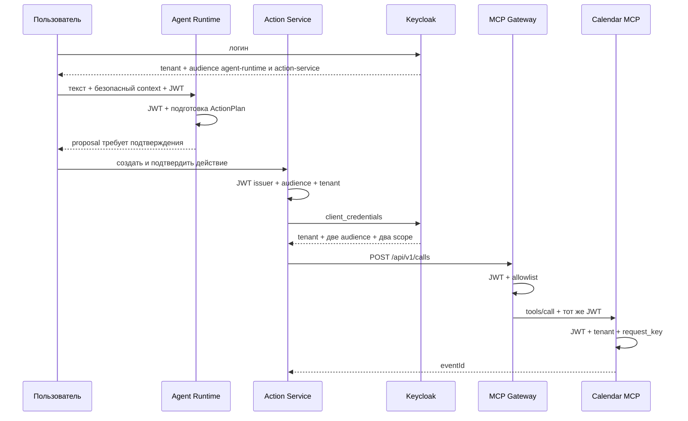

# Архитектура

```text
репа сервиса -> общий CI -> container + SBOM + signature
                              |
services/catalog.json -> environments/<env>/services/<name>/values.yaml
                              |
                      Argo CD ApplicationSet
                              |
                       charts/service -> Kubernetes
                              |
                  OpenTelemetry -> metrics/logs/traces
```

`services/catalog.json` — реестр сервисов, `environments` — различия окружений, а
`charts/service` — единые правила запуска. В values нет секретов: указываются только ссылки на
ключи Kubernetes Secret. Production намеренно не создан до отдельного ADR и выбора облака.

Локальная среда работает через Compose и использует те же классы зависимостей, что будущий
кластер. Полный smoke создаёт только временный k3d-кластер и всегда удаляет лишь созданный им
кластер.

## Локальный execution slice



Canonical issuer локального realm доступен хосту через `localhost`. Контейнеры загружают JWKS по
внутреннему имени `keycloak`, поэтому проверка токена не зависит от DNS хоста. `start-local -Apps`
сначала поднимает зависимости и создаёт Temporal namespace, затем собирает и запускает приложения.
Agent Runtime не исполняет и не сохраняет действие. Он создаёт предложение по контракту `2.1.0`;
после подтверждения Action Service становится источником состояния, аудита и Temporal workflow.
